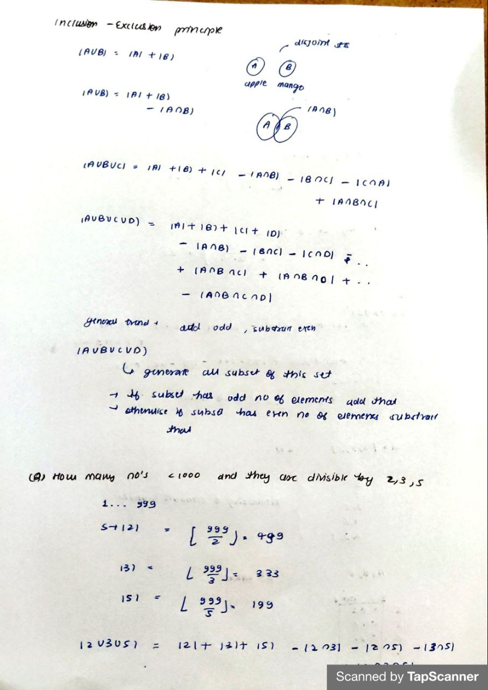
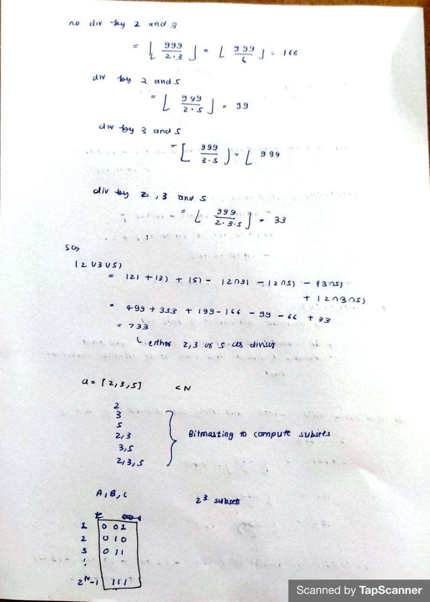

---

Not So Easy Math

```cpp
#include<bits/stdc++.h>
using namespace std;
#define ll long long

int main(){
	int tc;
	cin>>tc;
	ll primes[] = {2,3,5,7,11,13,17,19};
	while(tc--){
		ll n;
		cin>>n;

		ll subsets = (1<<8);
		ll ans = 0;
		
		for(ll mask=1;mask<subsets;++mask){
			ll denom = 1LL;
			ll setBits = __builtin_popcount(mask);

			for(ll j=0;j<=7;++j){
				if(mask&(1<<j)){
					denom = denom * primes[j];
				}
			}

			if(setBits%2==1){
				ans += (n/denom);
			}else{
				ans -= (n/denom);
			}

		}

		cout<< ans <<endl;
	}

	return 0;
}
```