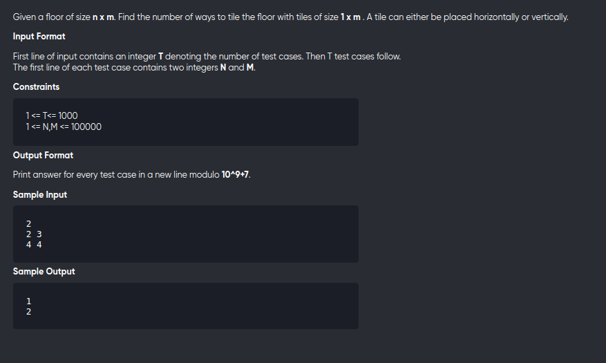

[Problem](https://practice.geeksforgeeks.org/problems/count-the-number-of-ways-to-tile-the-floor-of-size-n-x-m-using-1-x-m-size-tiles0509/1)

---

---

```cpp
#include<bits/stdc++.h>
using namespace std;
#define mod 1000000007
#define int long long 

int dp[100005];

int F(int N,int M){
	if(N < M) return 1;
	if(N == M) return 2;

	if(dp[N]) return dp[N];

	return dp[N] = (F(N-1,M) + F(N-M,M)) % mod;
}

void solve(){
	int n,m;
	cin>>n>>m;
	memset(dp,0,sizeof dp);
	cout<< F(n,m) <<"\n";

}

signed main(){
	int t;
	cin>>t;
	while(t--){
		solve();
	}
	return 0;
}
```