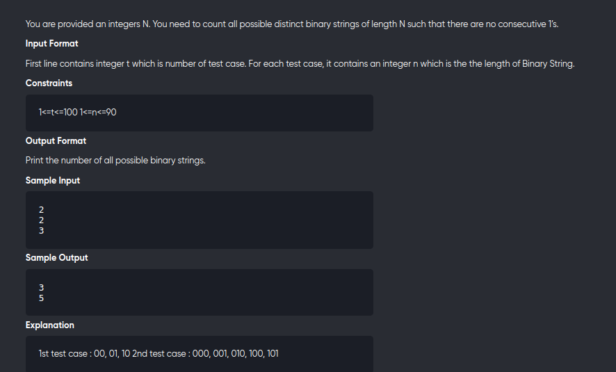

[Problem](https://practice.geeksforgeeks.org/problems/consecutive-1s-not-allowed1912/1)
---


---

```cpp
#include<bits/stdc++.h>
using namespace std;
#define int long long

int dp[105][2];

int F(int N,bool lastWasOne){
	if(N==0) return 1;
	if(dp[N][lastWasOne]!=-1) return dp[N][lastWasOne];

	if(lastWasOne){
		return dp[N][lastWasOne] = F(N-1,false);
	}
	return dp[N][lastWasOne] = F(N-1,true) + F(N-1,false);
}

void solve(){
	int n;
	cin>>n;
	memset(dp,-1,sizeof dp);
	cout<< F(n,0) << "\n";
}

signed main(){
	int t;
	cin>>t;
	while(t--){
		solve();
	}
	return 0;
}
```