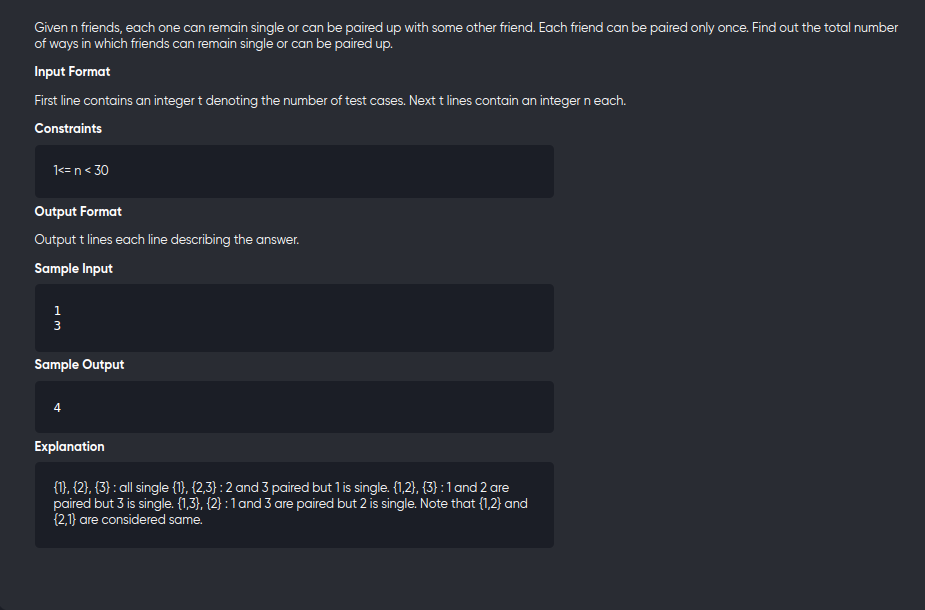

[Problem](https://practice.geeksforgeeks.org/problems/friends-pairing-problem5425/1)

---

---

```cpp
#include<iostream>
using namespace std;
#define int long long

int dp[31];

int F(int N){
	if(N<=1) return 1;
	if(dp[N]) return dp[N];

	return dp[N]  = F(N-1) + (N-1)*F(N-2);
}

void solve(){
	int n;
	cin>>n;
	memset(dp,0,sizeof dp);
	cout<< F(n) <<"\n";
}

signed main() {
	int t;
	cin>>t;
	while(t--){
		solve();
	}
	return 0;
}
```