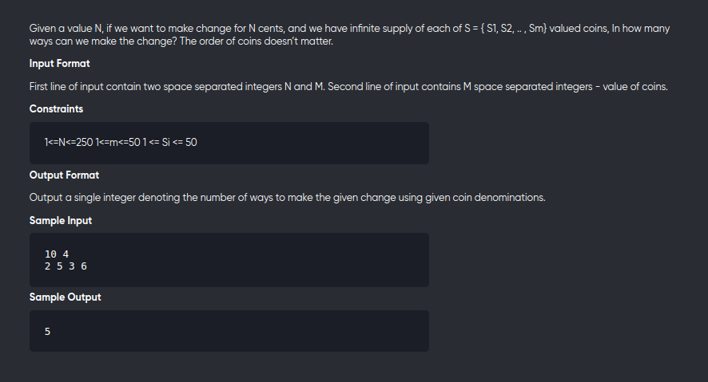

[Problem](https://online.codingblocks.com/app/player/239940/content/227467/4828/code-challenge)

---



---

```cpp
#include<bits/stdc++.h>
using namespace std;
#define int long long 

int dp[51][255];

int F(int idx,int sum,const vector<int> &v){
	if(sum==0) return 1;
	if(sum < 0 || idx==-1) return 0;
	
	if(dp[idx][sum] != -1) return dp[idx][sum];

	return dp[idx][sum] = F(idx,sum-v[idx],v) + F(idx-1,sum,v);
}

signed main(){
	int n,m;
	cin>>n>>m;
	vector<int> v(m);
	for(auto &c:v)
		cin>>c;

	memset(dp,-1,sizeof dp);
	cout<< F(m-1,n,v);

}
```