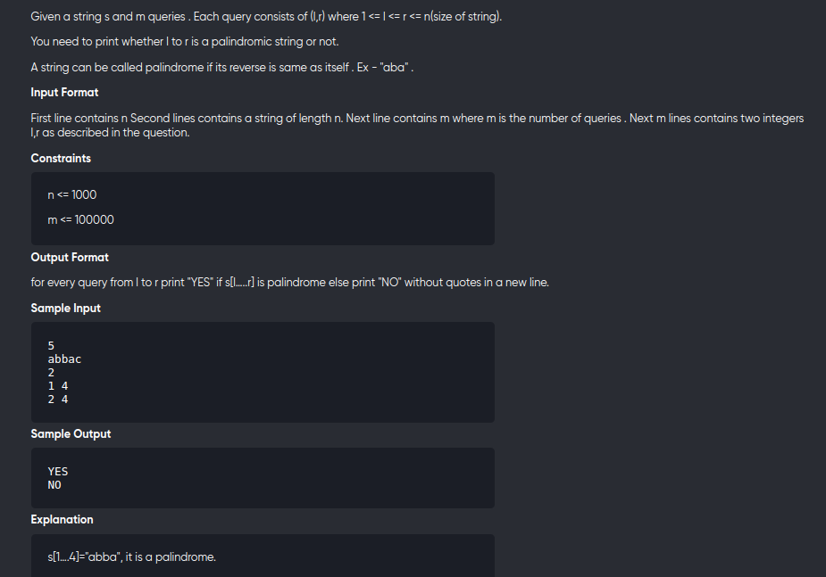

[Problem](https://online.codingblocks.com/app/player/239940/content/227445/6264/code-challenge)

---

---

```cpp
#include<bits/stdc++.h>
using namespace std;

vector<vector<int>> dp;

int recur(int l,int r,const string &s){
	if(l>=r)
		return true;
	if(dp[l][r]!=-1)
		return dp[l][r];
	

	dp[l][r] = (s[l]==s[r] && recur(l+1,r-1,s));

	return dp[l][r];
}

void solve(){
	int n;
	cin>>n;
	string s;
	cin>>s;

	dp.assign(n,vector<int>(n,-1));

	int q;
	cin>>q;

	while(q--){
		int l,r;
		cin>>l>>r;
		if(recur(l-1,r-1,s))
			cout<<"YES\n";
		else cout<<"NO\n";
	}


}

int main () {
	solve();
}
```