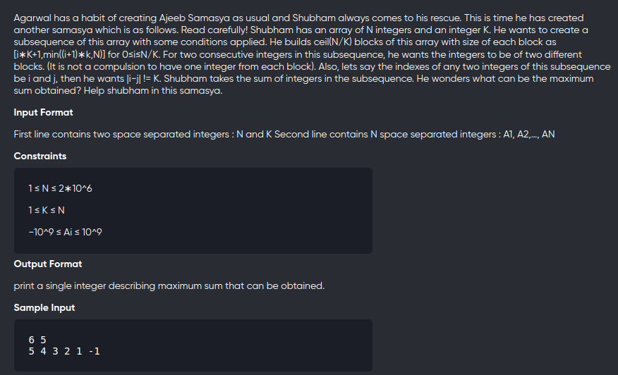

[Problem](https://www.codechef.com/problems/JCWC00) <br>




```cpp
#include<bits/stdc++.h>
using namespace std;
#define int long long 


void solve(){
    int n,k;
	cin>>n>>k;
	vector<int> v(n),dp(n,1e-16);
	for(auto &c:v) 
		cin>>c;
	
	int m1=LLONG_MIN,m2=LLONG_MIN,idx=-1;
	for(int i=0;i<min(n,k);++i){
		if(v[i] > m1){
			m2 = m1;
			m1 = v[i];
			idx = i;
		}else if(v[i]>m2){
			m2 = v[i];
		}
		dp[i] = v[i];
	}


	for(int i=k;i<n;i+=k){
		for(int j=i;j<min(n,i+k);++j){
			if(j-idx==k){
				dp[j] = max(dp[j] , v[j] + m2 ); 
			}else{
				dp[j] = max(dp[j] , v[j] + m1 );
			}
		}

		for(int j=i;j<min(n,i+k);++j){
			if(dp[j] > m1){
				m2 = m1;
				m1 = dp[j];
				idx = j;
			}else if(dp[j]>m2){
				m2 = dp[j];
			}
		}
	}

	cout<< *max_element(begin(dp),end(dp)) <<endl;
}

signed main(){
    int t;
    cin>>t;
    while(t--){
        solve();
    }
	return 0;
}
```

Time Complexity : O(n) <br>