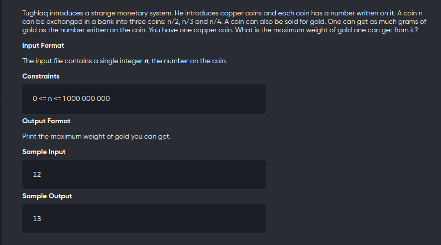

[Problem](https://www.codechef.com/problems/COINS)
---


---

Multiple INput

```cpp
#include<bits/stdc++.h>
using namespace std;
#define int long long

map<int,int> mp;

int recur(int n){
	if(n <= 1)
		return n;
	if(mp.count(n))
		return mp[n];
	return mp[n] = max(n,recur(n/2)+recur(n/3)+recur(n/4));
}

void solve(int n){
	cout<< recur(n)<<endl;
}

signed main(){
    int n;
    while(cin>>n){
        solve(n);
    }
	return 0;
}
```

---
Single Input

```cpp
#include<bits/stdc++.h>
using namespace std;
#define int long long

map<int,int> mp;

int recur(int n){
	if(n <= 1)
		return n;
	if(mp.count(n))
		return mp[n];
	return mp[n] = max(n,recur(n/2)+recur(n/3)+recur(n/4));
}

void solve(){
	int n;
	cin>>n;
	cout<< recur(n);
}

signed main(){
	solve();
	return 0;
}
```