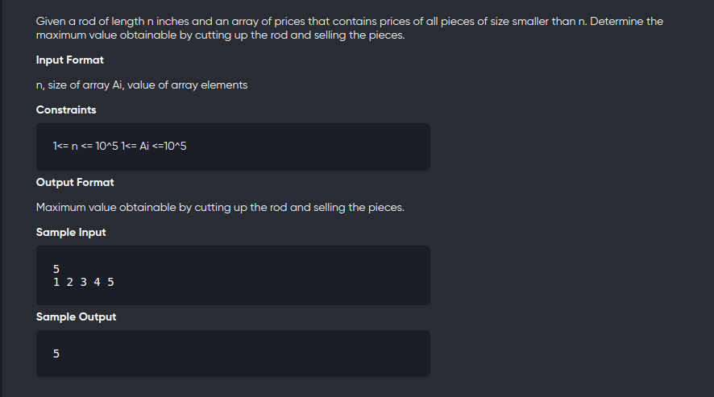

[Problem](https://online.codingblocks.com/app/player/239940/content/227467/5224/code-challenge)
---



---

```cpp
#include<bits/stdc++.h>
using namespace std;
#define int long long 

void solve(){
	int n;
	cin>>n;
	vector<int> cost(n+1);
	for(int i=1;i<=n;++i)
		cin>>cost[i];
	vector<int> dp(n+1);
	dp[0] = 0;

	for(int i=1;i<=n;++i){
		for(int j=0;j<=i;++j){
			dp[i] = max(dp[i] , cost[j] + dp[i-j] );
		}
	}

	cout<<dp[n]<<endl;
}

signed main(){
	solve();
	return 0;
}
```