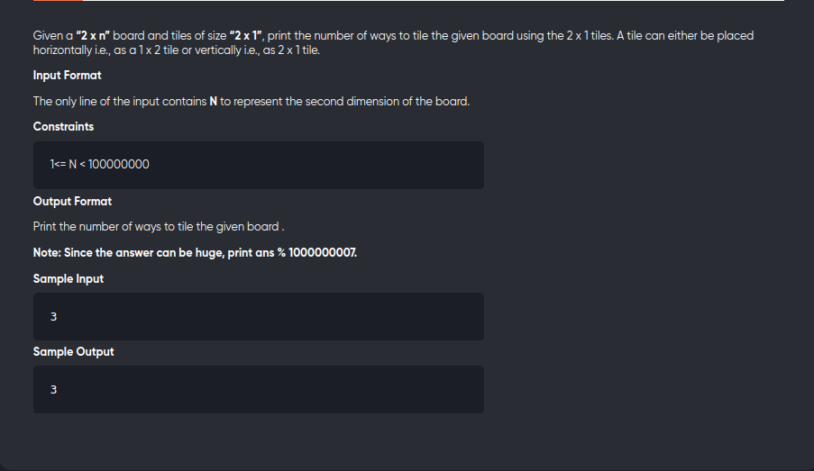

[Problem](https://practice.geeksforgeeks.org/problems/ways-to-tile-a-floor5836/1)

---



---

```cpp
#include<bits/stdc++.h>
using namespace std;
#define int long long
#define mod 1000000007

void solve(){
	int n;
	cin>>n;
	int a=0,b=0,c=0;
	a = 1;
	b = 1;
	for(int i=2;i<=n;++i){
		c = (a + b) % mod;
		a = b;
		b = c;
	}
	cout<< b <<endl;
}

signed main(){
	solve();
	return 0;
}
```