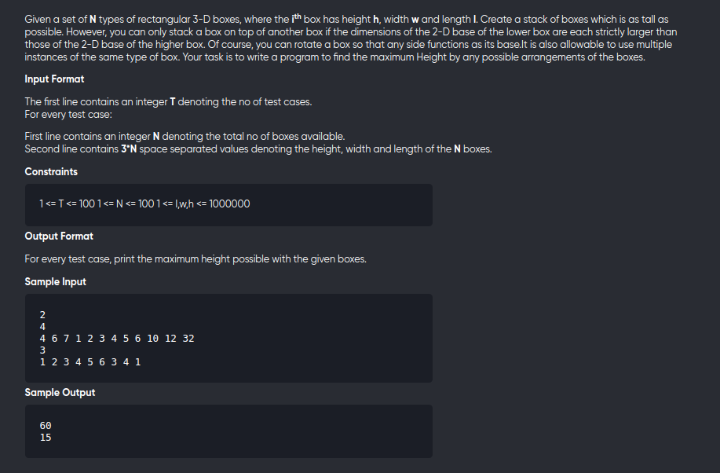

[Problem](https://practice.geeksforgeeks.org/problems/box-stacking/1)

---



---

```cpp
#include<bits/stdc++.h>
using namespace std;

class box{
        public:
            int l,b,h;
        box(int l,int b,int h){
            this->l = l;
            this->b = b;
            this->h = h ;
        }
        bool operator < (box &b2){
            return this->l<b2.l && this->b<b2.b;
        }
};
   
    int maxHeight(int height[],int width[],int length[],int n)
    {
       vector<int> dp;
        vector<box> v;
        int l,b,h;
        for(int i=0;i<n;++i){
            l = length[i];
            b = width[i];
            h = height[i];
            //trying out all possible bases
            v.push_back(box(l,b,h));
            v.push_back(box(b,l,h));
            v.push_back(box(l,h,b));
            v.push_back(box(h,l,b));
            v.push_back(box(b,h,l));
            v.push_back(box(h,b,l));
        }
        
        dp = vector<int>(v.size(),0);
        
        sort(begin(v),end(v),[&](box &b1,box &b2)->bool{
            if(b1.l==b2.l){
                if(b1.b==b2.b)
                    return b1.h < b2.h;
                return b1.b < b2.b;
            }
            return b1.l<b2.l;
        });
        
        int ans = 0;
        
        for(int i=0;i<v.size();++i){
            dp[i] = v[i].h;
            for(int j=0;j<i;++j){
                if(v[j] < v[i]){
                    dp[i] = max(dp[i],v[i].h+dp[j]);
                }
            }
            ans = max(ans,dp[i]);
        }
        
        return ans;
    }

void solve(){
	int n;
	cin>>n;
	vector<vector<int>> v(n,vector<int>(3));

	int height[n],width[n],length[n];
	for(int i=0;i<n;++i){
		cin>>height[i];
		cin>>width[i];
		cin>>length[i];
	}

	cout<< maxHeight(height,width,length,n) <<"\n";

}

int main(){
	int tc;
	cin>>tc;
	while(tc--){
		solve();
	}
	return 0;
}
```