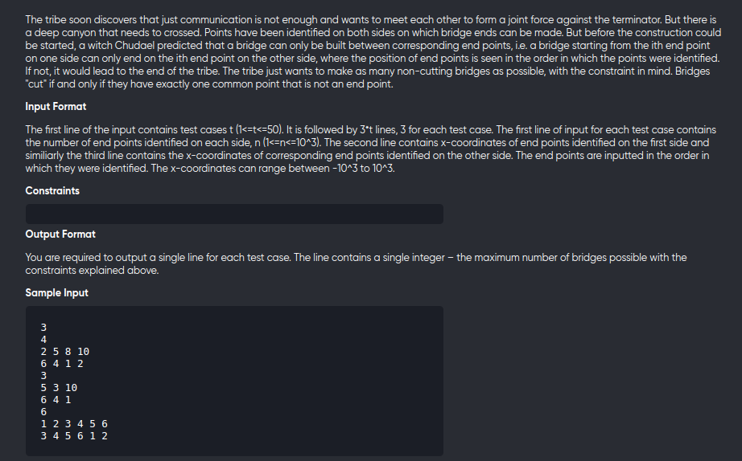

[Problem](https://www.spoj.com/problems/BRIDGE/cstart=30)

---


---

```cpp
#include<bits/stdc++.h>
using namespace std;
#define int long long

void solve(){
	int n;
	cin>>n;
	vector<pair<int,int>> v(n);

	for(auto &c:v)
		cin>>c.first;
	for(auto &c:v)
		cin>>c.second;

	sort(begin(v),end(v));

	vector<int> dp(n,1);
	int ans = 1;
	for(int i=1;i<n;++i){
		for(int j=0;j<i;++j){
			if(v[i].second >= v[j].second)
				dp[i] = max(dp[i],1+dp[j]);
		}
		ans = max(ans,dp[i]);
	}
	cout<<ans<<endl;
}

signed main(){
	int tc;
	cin>>tc;
	while(tc--){
		solve();
	}
	return 0;
}
```