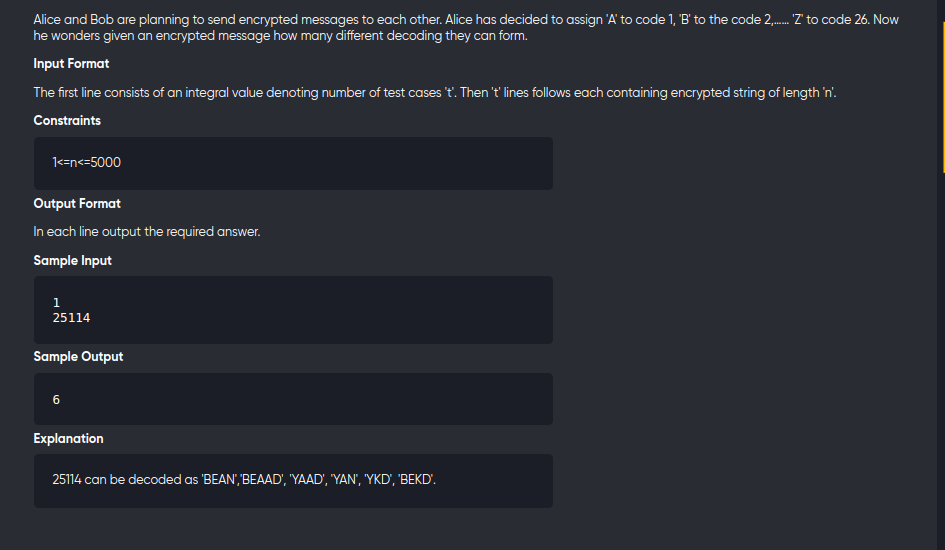

[Problem](https://leetcode.com/problems/decode-ways/)
---



---

```cpp
#include<bits/stdc++.h>
using namespace std;
#define int long long

void solve(){
	string s;
	cin>>s;

	int a=1,b=1;
    for(int i=0;i<s.length();++i){
        int c = 0;
        if(s[i] >= '1'){
            c = b;
        }
        if(i-1>=0 && s.substr(i-1,2)>="10" && s.substr(i-1,2)<="26"){
            c += a;
        }
        a = b;
        b = c;
    }
    cout<<b<<"\n";
}

signed main() {
	int tc;
	cin>>tc;
	while(tc--){
		solve();
	}
	return 0;
}
```