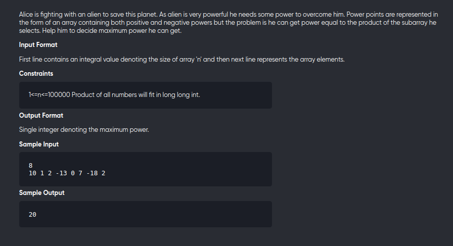

[Problem](https://leetcode.com/problems/maximum-product-subarray/)

---


---

```cpp
#include<bits/stdc++.h>
using namespace std;
#define int long long

void solve(){
	int n;
	cin>>n;
	vector<int> a(n);

	for(auto &c:a)
		cin>>c;

    long long neg=a[0],pos=a[0],res=a[0];
    for(int i=1;i<n;++i){
        long long x = a[i];
        res = max(res,max(neg*x,max(pos*x,x)));
        long long nneg = min(x,min(neg*x,pos*x));
        long long npos = max(x,max(pos*x,neg*x));
        neg = nneg,pos = npos;
    }

    cout<< res <<endl;
}

signed main() {
	solve();
	re
```