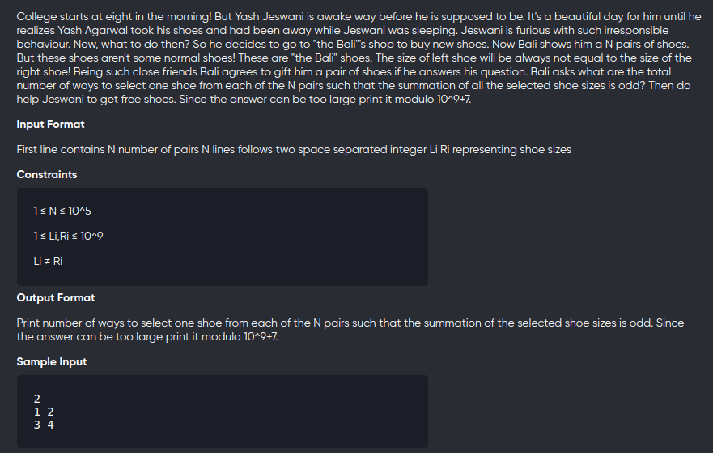
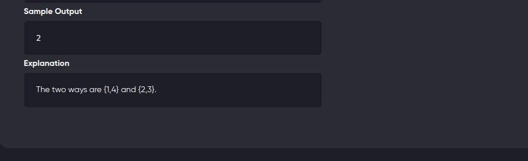

[Problem](https://www.codechef.com/problems/JCWC02)
---



---

```cpp
#include<bits/stdc++.h>
using namespace std;
#define int long long 
#define mod 1000000007

long mPow(long x,long y){
	if(x==0)
		return 0;
	long ans = 1;

	while(y){
		if(y&1)
			ans = (ans * x) % mod;
		x = (x*x) % mod;
	 	y /= 2;
	}

	return ans;
}

void solve(){
	int n;
	cin>>n;
	int OO=0,OE=0;

	for(int i=0;i<n;++i){
		int x,y;
		cin>>x>>y;
		if(y & 1)
			swap(x,y);
		if( (x&1) && (y&1))
			++OO;
		else if(x&1)
			++OE;
	}

	if(OE==0 && OO%2==1)
		cout<< mPow(2,n) <<endl;
	else if(OE != 0)
		cout<< mPow(2,n-1) <<endl;
	else cout<<0<<endl;

}

signed main(){
    int tc;
    cin>>tc;
    while(tc--){
        solve();
    }
	return 0;
}
```