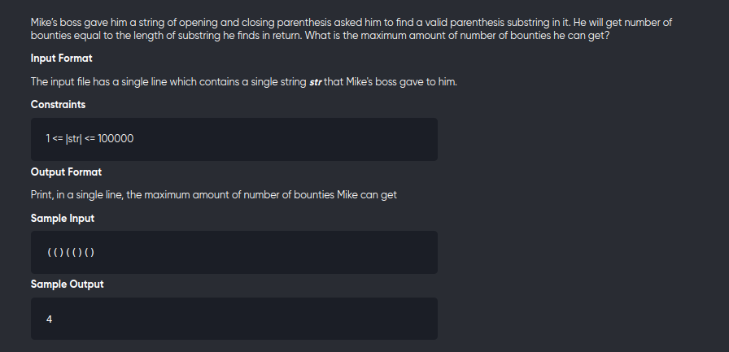

[Problem](https://leetcode.com/problems/longest-valid-parentheses/)

---



---

```cpp
#include<bits/stdc++.h>
using namespace std;
#define int long long

void solve(){
	string s;
	cin>>s;
	const int n = s.length();

	stack<int> st;

	int ans = 0;
	vector<int> dp(n,0);

	if(s[0]=='(')
		st.push(0);

	for(int i=1;i<n;++i){
		if(s[i]==')'){
			if(!st.empty()){
				int j = st.top();
				st.pop();
				dp[i] = i-j+1 + (j-1>=0 ? dp[j-1] : 0);
			}
		}else st.push(i);
		ans = max(ans,dp[i]);
	}	

	cout<<ans<<endl;
}

signed main(){
	solve();
	return 0;
}

// (((())))


// ---


// #include<bits/stdc++.h>
// using namespace std;
// #define int long long

// void solve(){
// 	string s;
// 	cin>>s;
// 	const int n = s.length();

// 	stack<int> st;

// 	int ans = 0;
// 	vector<int> dp(n,0);

// 	if(s[0]=='(')
// 		st.push(0);

// 	for(int i=1;i<n;++i){
// 		if(s[i]==')'){
// 			if(s[i-1]=='('){
// 				dp[i] = 2 + (i-2>=0 ? dp[i-2] : 0);
// 				st.pop();
// 			}else if(!st.empty()){
// 				int j = st.top();
// 				st.pop();
// 				dp[i] = i-j+1 + (j-1>=0 ? dp[j-1] : 0);
// 			}
// 		}else st.push(i);
// 		ans = max(ans,dp[i]);
// 	}	

// 	cout<<ans<<endl;
// }

// signed main(){
// 	solve();
// 	return 0;
// }

// // (((())))
```