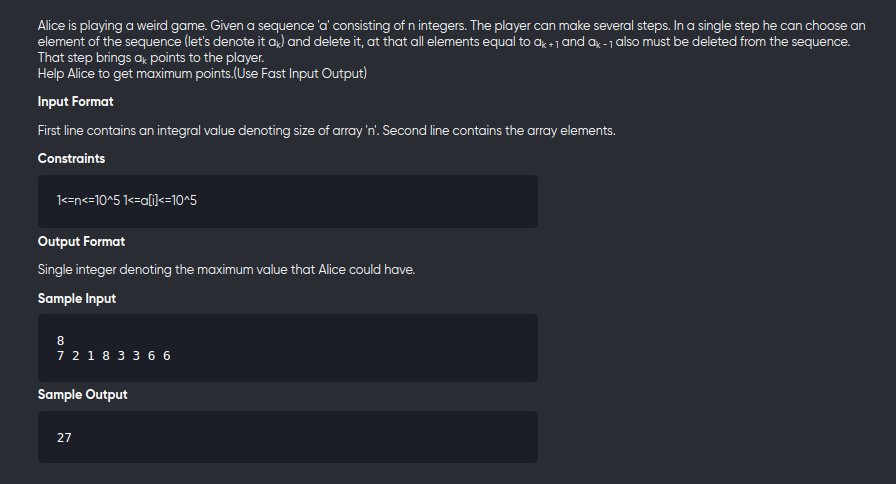

[Problem](https://online.codingblocks.com/app/player/239940/content/227467/5200/code-challenge)

---

---

```cpp
#include<bits/stdc++.h>
using namespace std;
#define int long long

int cnt[100001],dp[100001];

void solve(){
	int n;
	cin>>n;
	memset(cnt,0,sizeof cnt);
	memset(dp,0,sizeof dp);

	int m = 0;
	for(int i=0;i<n;++i){
		int x;
		cin>>x;
		cnt[x]++;
		m = max(m,x);
	}
	dp[0] = 0;
	dp[1] = cnt[1];
	for(int i=2;i<=m;++i){
		dp[i] = max(i*cnt[i] + dp[i-2] , dp[i-1]);
	}
	
	cout<< dp[m] <<endl;
}

signed main(){
	solve();
	return 0;
}
```