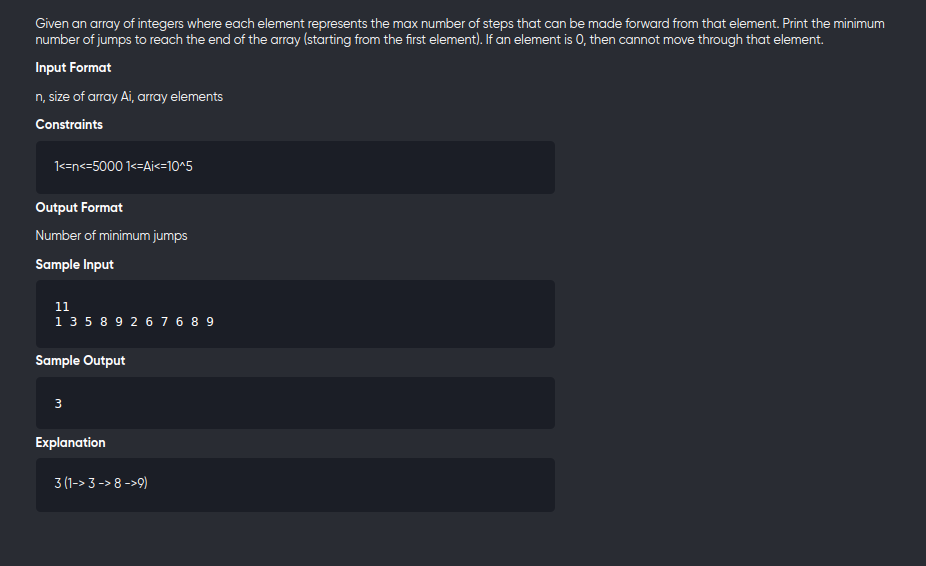

[Problem](https://practice.geeksforgeeks.org/problems/jump-game/1)

---

---

```cpp
#include<bits/stdc++.h>
using namespace std;
#define int long long

void solve(){
	int n;
	cin>>n;
	vector<int> v(n);

	for(auto &c:v)
		cin>>c;
	
	vector<int> dp(n,n+1);
	dp[0] = 0;

	for(int i=1;i<n;++i){
		for(int j=0;j<i;++j){
			if(i-j<=v[j])
				dp[i] = min(dp[i] , 1 + dp[j]);
		}
	}	

	cout<< dp[n-1] <<endl;

}

signed main(){
	solve();
	return 0;
}
```

NOTE : can be improved to O(n) time and O(1) space using greedy 