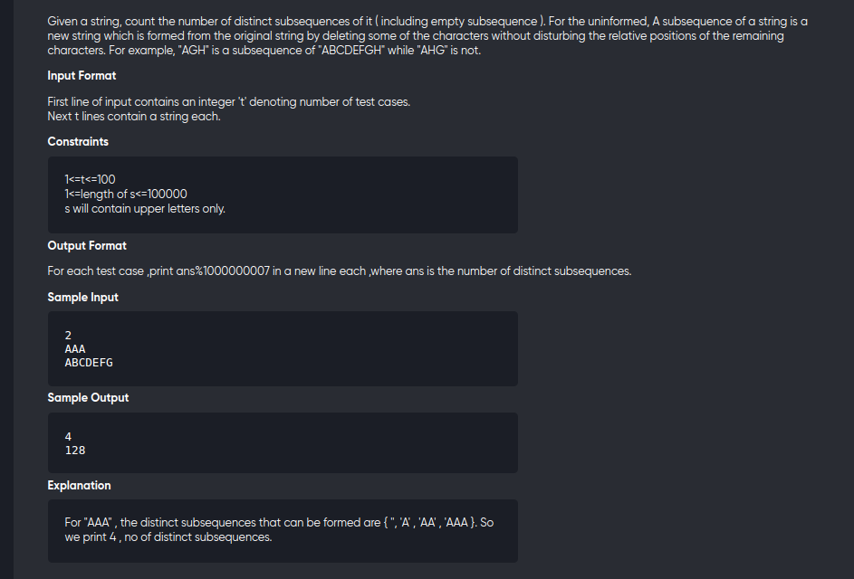

[Problem](https://www.spoj.com/problems/DSUBSEQ/)

---



---

```cpp
#include<bits/stdc++.h>
using namespace std;
#define int long long
#define mod 1000000007

void solve(){
	string s;
	cin>>s;
	const int n = s.length();

	vector<int> cnt(26,0);

	for(int i=0;i<n;++i){
		char x = s[i];
		cnt[x-'A'] = ( 1+accumulate(begin(cnt),end(cnt),0LL)) % mod;
	}
	
	cout<< ( 1+accumulate(begin(cnt),end(cnt),0LL)) % mod <<endl;
}

signed main(){
	int t;
	cin>>t;
	while(t--){
		solve();
	}
	return 0;
}
```
