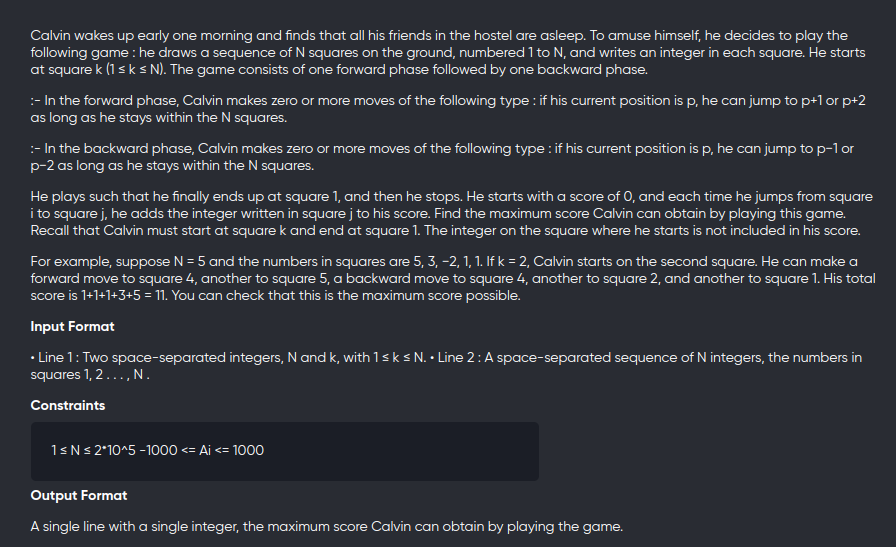
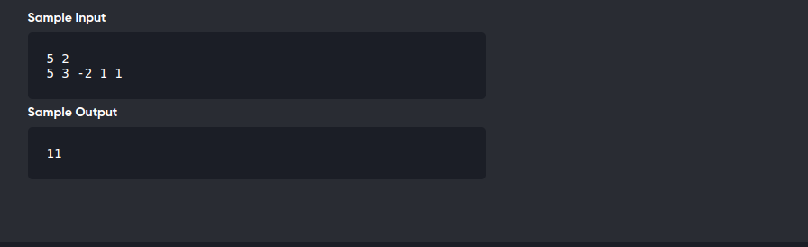

[Problem](https://www.codechef.com/INOIPRAC/problems/INOI1301)

---




---

```cpp
#include<bits/stdc++.h>
using namespace std;
#define int long long

void solve(){
	int n,k;
	cin>>n>>k;

	vector<int> v(n+1);
	for(int i=1;i<=n;++i)
		cin>>v[i];
	
	vector<int> dpf(n+1,0),dpb(n+1,0);
    dpf[k] = 0;
    if(k+1<=n) 
        dpf[k+1] = v[k+1];
	for(int j=k+2;j<=n;++j){
		dpf[j] = v[j] + max(dpf[j-1],dpf[j-2]);
	}

	dpb[1] = v[1];
	if(n>=2) dpb[2] = v[1]+v[2];
	for(int j=3;j<=n;++j){
		dpb[j] = v[j] + max(dpb[j-1],dpb[j-2]);
	}

	int ans = INT_MIN;

	for(int i=k;i<=n;++i){
		ans = max(ans,dpf[i]+dpb[i]-v[i]);
	}

	cout<<ans<<endl;
}

signed main(){
    ios_base::sync_with_stdio(false);
    cin.tie(nullptr);
	solve();
	return 0;
}
```