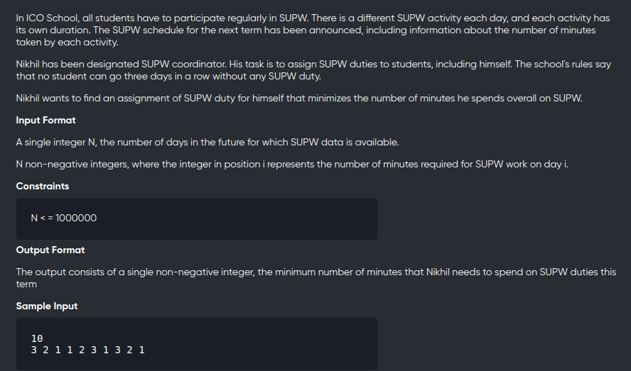
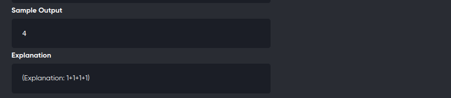

[Problem](https://www.codechef.com/ZCOPRAC/problems/ZCO14002)
---



---

```cpp
#include<bits/stdc++.h>
using namespace std;
#define int long long

void solve(){
	int n;
	cin>>n;
	
	vector<int> a(n),dp(n);
	for(auto &c:a){
		cin>>c;
	}

	for(int i=0;i<min(3ll,n);++i)
		dp[i] = a[i];

	for(int i=3;i<n;++i){
		dp[i] = a[i] + min({dp[i-1],dp[i-2],dp[i-3]});
	}

	int ans = dp[n-1];
	if(n-2>=0) ans = min(ans,dp[n-2]);
	if(n-3>=0) ans = min(ans,dp[n-3]);
	cout<<ans<<endl;
}

signed main(){
	solve();
	return 0;
}
```