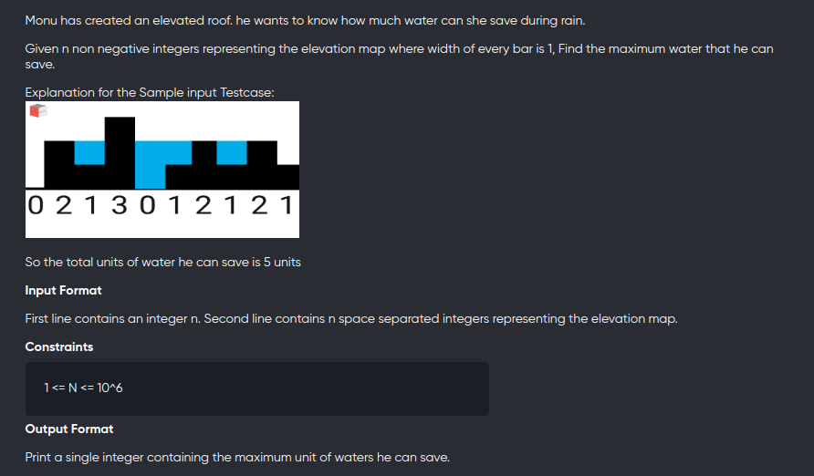
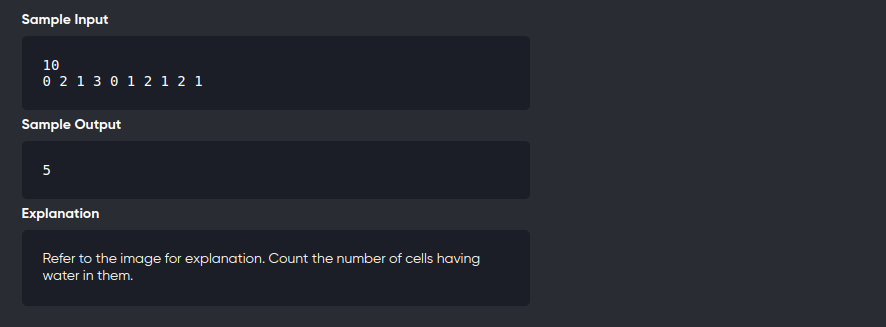

[Problem](https://leetcode.com/problems/trapping-rain-water/)
---




---

```cpp
#include<bits/stdc++.h>
using namespace std;
#define int long long

void solve(){
	int n;
	cin>>n;
	vector<int> v(n),left(n),right(n);

	for(auto &c:v)
		cin>>c;
	
	left[0] = v[0];
	right[n-1] = v[n-1];

	for(int i=1;i<n;++i){
		left[i] = max(left[i-1],v[i]);
	}

	for(int i=n-2;i>=0;--i){
		right[i] = max(right[i+1],v[i]);
	}

	int ans = 0;
	for(int i=0;i<n;++i){
		ans += min(left[i],right[i])-v[i];
	}
	cout<<ans<<endl;

}

signed main(){
	solve();
	return 0;
}
```