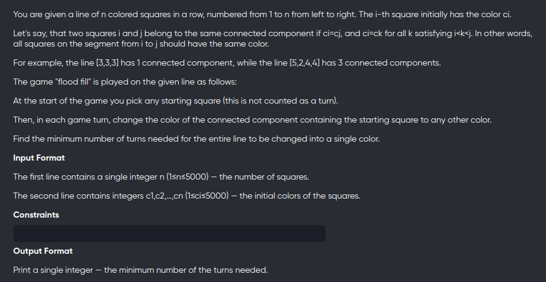
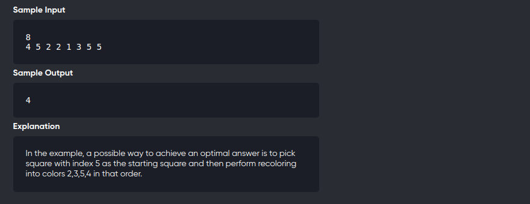

[Problem](https://codeforces.com/problemset/problem/1114/D)
---



---

```cpp
#include<bits/stdc++.h>
using namespace std;

vector<vector<int>> dp;
vector<int> v;

int recur(int l,int r){
	if(l==r)
		return 0;
	if(l+1==r)
		return 1;
	if(dp[l][r]!=-1)
		return dp[l][r];
	if(v[l]==v[r])
		return dp[l][r] = 1 + recur(l+1,r-1);
	return dp[l][r] = 1 + min(recur(l+1,r),recur(l,r-1));
}

void solve(){
	int n;
	cin>>n;
	v.clear();

	for(int i=0;i<n;++i){
		int x;
		cin>>x;
		if(v.empty() || v.back()!=x)
			v.push_back(x);
	}

	n = v.size();
	dp.assign(n+1,vector<int>(n+1,-1));
	
	cout<< recur(0,n-1);
}

int main(){
	solve();
	return 0;
}
```