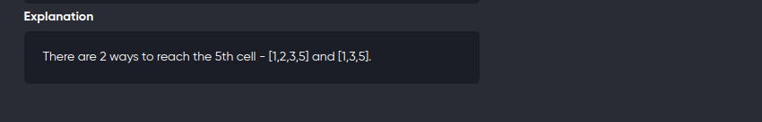

[Problem](https://online.codingblocks.com/app/player/239940/content/227467/4833/code-challenge)
---




---

```cpp
#include<bits/stdc++.h>
using namespace std;
#define int long long 
#define mod 1000000007

void solve(){
	int n,k;
	cin>>n>>k;
	vector<int> v(n);
	for(int i=0;i<n;++i){
		cin>>v[i];
	}

	vector<int> dp(n+1,0);
	dp[0] = 1;

	for(int i=1;i<n;++i){
		if(v[i])
			continue;
		for(int j=i-1;j>=0 && i-j<=k ;--j){
			dp[i] = ( dp[i] + dp[j]) % mod;
		}
	}

	cout<< dp[n-1]%mod <<endl;
}

signed main(){
	solve();
	return 0;
}
```