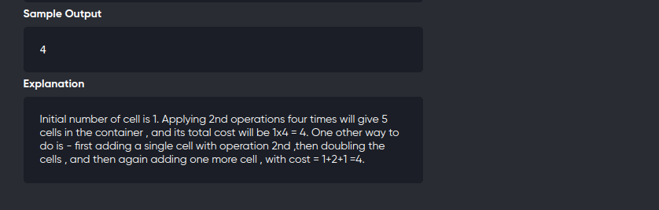

[Problem](https://online.codingblocks.com/app/player/239940/content/227467/5037/code-challenge)
---




---

```cpp
/*
  Writer : ADITYA PATEL
*/

#include "bits/stdc++.h"
using namespace std;
#define int long long
#define endl "\n"


void solve(int cTc){
  int N,x,y,z;
  cin>>N>>x>>y>>z;
  vector<int> dp(N+1,0);

  for(int i=2;i<=N;++i){
    if(i%2==0){
      dp[i] = min(dp[i/2]+x , dp[i-1]+y);
    }else{
      dp[i] = min(dp[i-1]+y , dp[(i+1)/2]+x+z);
    }
  }

  cout<<dp[N];


}

signed main(){
 
  int tc=1;
  for(int cTc=1;cTc<=tc;++cTc){
    solve(cTc);
  }

  return EXIT_SUCCESS;
}
```